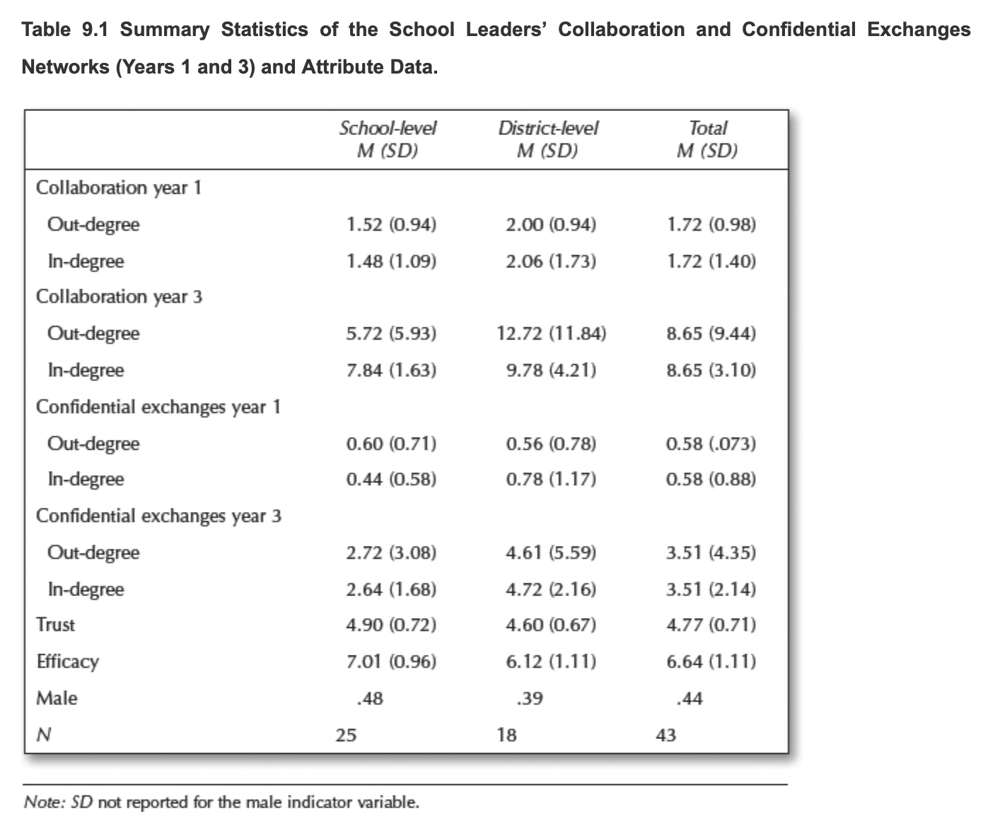

```{r setup, include=FALSE}
knitr::opts_chunk$set(echo = FALSE)

library(fontawesome)
library(kableExtra)
library(gtsummary)
```
# PREPARE

This study was completed as part of the summer 2021 Social Network Analysis in Education course (ECI 589) at North Carolina State University. The course is the last of the series of courses offered as part of the Learning Analytics Certificate Program.

The Rmarkdown file can be downloaded from the code folding control button in the upper right hand of this page. The full R Studio project can be access via [this Github repository](https://github.com/jennhouchins/ECI589-SNA). The text for this course is [Social Network Analysis and Education: Theory, Methods &
Applications](https://methods.sagepub.com/book/social-network-analysis-and-education) from @carolan2014. The data for this project can be obtained from this text's companion site.

## Context

This independent analysis uses data from Daly's Network of School 
Leaders presented in Chapter 3 of @carolan2014. These data were collected at two school districts over 3 consecutive years and include:

- **individual demographics** (e.g., gender, ethnicity, etc)
- **network relationships** (e.g., collaboration, confidential, etc)
 - **frequency of interactions** with others on a four-point scale ranging from 1 (the least frequent) to 4 (1–2 times a week)
- 18 **efficacy** items based on the Principal Efficacy Scale used in the Daly et al. (2011) and Tschannen-Moran and Gareis's (2004) studies and rated 
on a 9-point Likert scale ranging from 1 (None at all) to 9 (A great deal)
- 8 **trust** items rated on a 7-point Likert scale ranging from 1 (Strongly disagree) to 7 (Strongly agree) modified from Tschannen-Moran and Hoy (2003).

## Guiding Questions and Methods

This study focuses on the **confidential exchanges**
between school leaders in **year 1** and is framed by the following questions:

1.  Does gender or some other individual attribute predict confidential
    exchanges between school leaders?

2.  Do school leaders prefer to confide in others at the same level of 
    leadership (i.e., school or district)?

The analysis employs **Exponential-family Random Graph Models (ERGMs)** to answer these questions.


## R Packages

The following R packages were used for the analyses carried out in this study.

```{r load-libs, echo=TRUE, message=FALSE}
library(readxl)
library(here)
library(tidyverse)
library(igraph)
library(tidygraph)
library(ggraph)
library(deldir)
library(statnet)
```

## Import the Data

The data were imported from the @carolan2014 text's Chapter 9 Excel files provided on the text 
companion site. There are two Excel files:

- **School_Leaders_Data_Chapter_9_e.xlsx** provides the individual demographic data for the 43 school leaders in the network.
- **School_Leaders_Data_Chapter_9_c.xlsx** provides the adjacency matrix reports on "confidential exchange" ties of these 43 school leaders in year 1 of the study.

```{r data-import, echo=TRUE, message=FALSE}
leader_nodes <- read_excel(here("Presentation",
                                "data",
                                "School_Leaders_Data_Chapter_9_e.xlsx"),
                           col_types = c("text", "numeric", 
                                         "numeric", "numeric", "numeric"))

leader_matrix <- read_excel(here("Presentation",
                                 "data","School_Leaders_Data_Chapter_9_c.xlsx"), 
                            col_names = FALSE)
```

# WRANGLE

I've got all my libraries loaded and the data has been imported. So, let's go wrangle some data...

```{r data-adventure}
knitr::include_graphics(path = "https://media.giphy.com/media/5ihf4yMV81xK/giphy.gif")
```

## Dichotomize the Matrix

Dichotomizing is recoding edge values to 1s and 0s so that the valued matrix is a binary matrix. To accomplish this, I first create the matrix object.

```{r dichotomize-one, echo=TRUE}
leader_matrix <- leader_matrix %>%
  as.matrix()
```

Then I dichotomize it by setting less frequent ties to 0 and more frequent ties to 1.

```{r dichotomize-two, echo=TRUE}
leader_matrix[leader_matrix <= 2] <- 0

leader_matrix[leader_matrix >= 3] <- 1
```

Next, I add the node names as row and column names for the purpose of generating an edge-list for this network.

```{r dichotomize-three, echo=TRUE}
rownames(leader_matrix) <- leader_nodes$ID
colnames(leader_matrix) <- leader_nodes$ID
```

## Create Network Graph

In order to extract the edge list, I use the matrix to create an igraph graph object.

```{r adjacency-mat, echo=TRUE}
adjacency_matrix <- graph.adjacency(leader_matrix,
                                    diag = FALSE)

class(adjacency_matrix)
```

## Edge list
All this set up allows me to extract the edge-list from the igraph graph object. The result is a set of 25 ties between the school leaders.

```{r edge-list, echo=TRUE}
leader_edges <- get.data.frame(adjacency_matrix)


kable(leader_edges)
```

## Network Graph

With an edge list, I can now create a network graph object using my edges and nodes. This is shown in the following code chunk.

```{r network-graph, echo=TRUE}

leader_graph <- tbl_graph(edges = leader_edges,
                          nodes = leader_nodes,
                          directed = TRUE)

leader_graph
```

As you can see, the result is a directed graph with 43 nodes (the school leaders) and 25 edges. Since there are fewer edges than nodes, it should be safe to assume that some school leaders either did not engage in confidential exchanges in year 1 or, if they did, they did so very infrequently.

# EXPLORE

The following sections will provide some basic summary statistics of these data and a sociogram for visualizing the network.

## Node degrees

Before getting the summary statisitics, I calculate the in_degree and out_degree of the nodes with the following code.

```{r node-degrees}
leader_measures <- leader_graph %>%
  activate(nodes) %>%
  mutate(in_degree = centrality_degree(mode = "in")) %>%
  mutate(out_degree = centrality_degree(mode = "out"))

leader_measures
```

## Node Measures

With the in_degree and out_degree added to the network's measures, I can get the summary of these measures.

```{r node-measures}
node_measures <- leader_measures %>% 
  activate(nodes) %>%
  data.frame()

summary(node_measures) 
```

## Breaking it Down: School and District Level Descriptives

The following sections provide descriptives statistics for the in degree, out degree, trust, and efficacy of the network delineated by level of administration (i.e., school or district level).

### In Degree

```{r in-degree}
in_degree_stats <- node_measures %>%
  group_by(DISTRICT.SITE) %>%
  summarise(n = n(),
            mean = mean(in_degree), 
            sd = sd(in_degree)
            ) 

kable(in_degree_stats)
```

### Out Degree

```{r out-degree}
out_degree_stats <- node_measures %>%
  group_by(DISTRICT.SITE) %>%
  summarise(n = n(),
            mean = mean(out_degree), 
            sd = sd(out_degree)
            )
kable(out_degree_stats)
```

### Trust

```{r trust}
trust_stats <- node_measures %>%
  group_by(DISTRICT.SITE) %>%
  summarise(n = n(),
            mean = mean(TRUST), 
            sd = sd(TRUST)
            )

kable(trust_stats)
```

### Efficacy

```{r efficacy}
efficacy_stats <- node_measures %>%
  group_by(DISTRICT.SITE) %>%
  summarise(n = n(),
            mean = mean(EFFICACY), 
            sd = sd(EFFICACY)
            )

kable(efficacy_stats)
```

### Comparison to @carolan2014

Examining these descriptive statistics, it appears I have successfully 
replicated the results shown in Table 9.1 of @carolan2014 for school leaders confidential exchanges in year 1. Table 9.1 is shown below.



## Visualize the Network

As you see below, visualizing the network for year 1 looks quite a bit different 
from the year 3 network. There are **far fewer confidential exchanges in year 1**.
Additionally, coloring the nodes by gender reveals that the groupings of confidential 
exchanges don't appear to consist of a single gender. Moreover, the node shapes 
(square for district-level and circle for school-level leader) appear to indicate that the groupings 
consist of either a majority of district-level leaders or school-level leaders. This 
suggests that administration level may be important in year 1 confidential networks. 
I'll take this into consideration as I use ERGM to model the network data.

```{r sociogram, echo=TRUE}
ggraph(leader_measures, layout = "fr") + 
  geom_node_point(aes(size = out_degree,
                      colour = factor(MALE),
                      fill = factor(MALE)),
                  shape = node_measures$DISTRICT.SITE + 21, show.legend = TRUE) +
  geom_node_text(aes(label = ID,
                     size = 1.5), 
                     repel=TRUE, show.legend = FALSE) +
  geom_edge_link(arrow = arrow(length = unit(1, 'mm')), 
                 end_cap = circle(2, 'mm'),
                 alpha = .3) + 
  theme_graph()
```

# MODEL

Setting up to perform an ERGM, I create a network object with these edges and nodes. The result is a directed network with 43 nodes (school leaders) and 25 edges.
```{r network}
leader_network <- as.network(leader_edges,
                             vertices = leader_nodes)

leader_network
```

## ERGM

To address my guiding questions, I ran the ERGM with all the individual attributes as well as the geometrically-weighed edgewise shared partner (GWESP) term for transitivity.
```{r ergm, message=FALSE, cache=TRUE}
set.seed(589)
my_ergm <- ergm(leader_network ~ edges +
                 mutual +
                 gwesp(0.25, fixed=T) +
                 nodefactor('MALE') +
                 nodecov('EFFICACY') +
                 nodecov('TRUST') +
                 nodematch('DISTRICT/SITE')
               )

summary(my_ergm)
```

While gender, efficacy, and trust do not appear to be significant predictors of 
confidential exchanges in year 1, the GWESP and the level of administration terms are significant is this model.


## Model Fit

Let's just take a look at the fit of this model using the `gof()` function and running 
some `mcmc.diagnostics()`.

### Goodness of Fit

Overall, the results of the `gof()` function show that this model fits reasonably well. That is, 
with the exception of the mutual term which isn't surprising given the p-value.

```{r ergm-fit, echo=TRUE}
my_ergm_gof <- gof(my_ergm)

plot(my_ergm_gof)
```

### MCMC Diagnostics

Next, I examine the Monte-Carlo Markov Chain (MCMC) diagnostics for this model. 

```{r mcmc-diag, echo=TRUE, message=FALSE}
mcmc.diagnostics(my_ergm)
```

Overall, the diagnostics are a little difficult to interpret but also appear to 
indicate that the model is a reasonable fit.

# COMMUNICATE

This study was framed by the following questions:

1.  Does gender or some other individual attribute predict confidential
    exchanges between school leaders?

2.  Do school leaders prefer to confide in others at the same level of 
    leadership (i.e., school or district)?

Answering question 1 based on the results in the previous sections, it would appear that the only individual 
attribute that predicts confidential exchanges in year 1 is whether a school leader 
is at the school or district level. Moreover, confidential exchanges also appear to be 
significantly impacted by transitivity represented by the geometrically-weighed edgewise 
shared partner term (i.e., "friend of a friend" phenomenon). These results suggest that, at least 
for year 1, school leaders appear to prefer to confide in others at the same level 
of administration.

# ABOUT THE AUTHOR
{width="90px" style="float: left; margin-right: 30px; margin-top: 5px;"}
Jennifer Houchins is Director of Technology Programs at the [Friday Institute for Eductional Innovation](http://fi.ncsu.edu) 
and a doctoral candidate in Learning Design and Technology at North Carolina 
State University. Her research examines students' use of computational thinking and the 
effective use of instructional technology to deepen conceptual understanding in both formal and 
informal K-12 learning environments. 

*You can learn more about Jennifer and her work by [visiting her website](https://jenniferkhouchins.com). You can also follow her on `r fontawesome::fa_i('twitter')`: [\@TooSweetGeek](https://twitter.com/TooSweetGeek)*

# GET THE PROJECT CODE

If you'd like to learn more about the techniques used in this
analysis (including the Rmarkdown techniques used in the write up), then you can get the R project from my
Github repo:<br />

<https://github.com/jennhouchins/ECI589-SNA>

# THE END OF AN ERA

This is the bittersweet end of my coursework in the Learning Analytics Certificate Program at NC State (and ultimately, my doctoral program coursework as well). I have enjoyed these courses and the learning community I've gained in them, but am very much looking forward to completely my dissertation and graduating.

```{r goodbye}
knitr::include_graphics(path = "https://media.giphy.com/media/3o6MbkFFhCkQOagDTO/giphy.gif")
```

# REFERENCES 